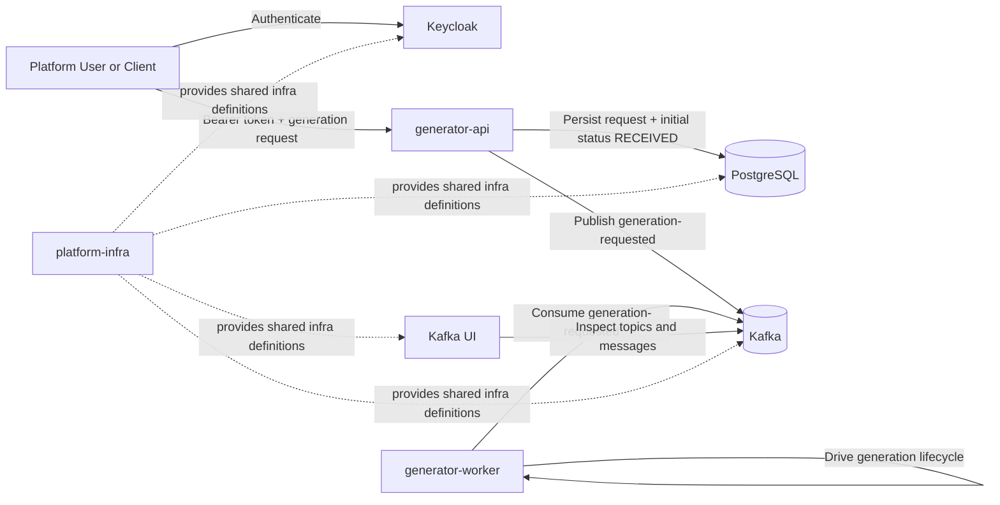
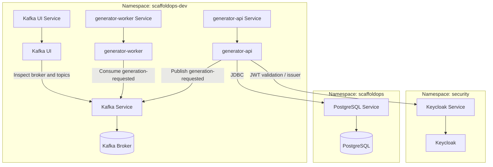

# ScaffoldOps High-Level Architecture

## Overview

ScaffoldOps currently combines a synchronous API entrypoint with an asynchronous worker pipeline.

- `generator-api` is the synchronous entrypoint for generation requests.
- `generator-api` persists requests in PostgreSQL and sets the initial lifecycle state, such as `RECEIVED`.
- `generator-api` publishes a `generation-requested` event to Kafka.
- `generator-worker` consumes that event and drives generation-stage transitions such as `RECEIVED -> GENERATING -> GENERATED` or `FAILED`.
- Keycloak provides authentication for protected API endpoints.
- Kafka UI is used for manual inspection of topics, messages, and consumer state.
- `platform-infra` provides the shared platform dependencies used by the services.

## Current Architectural Style

ScaffoldOps currently follows a hybrid REST + event-driven architecture:

- REST is used for synchronous request intake and request retrieval through `generator-api`.
- Event-driven messaging is used to hand off accepted requests from `generator-api` to `generator-worker` through Kafka.
- Shared infrastructure is provided centrally and consumed by application services.

## System Context

## Deployment View

## Responsibilities By Component

### `generator-api`

- Accepts generation requests through REST.
- Validates incoming request payloads.
- Persists requests in PostgreSQL.
- Sets the initial lifecycle state, such as `RECEIVED`.
- Publishes `generation-requested` to Kafka.
- Exposes protected request retrieval endpoints.

### `generator-worker`

- Consumes `generation-requested` events from Kafka.
- Orchestrates the generation stage asynchronously.
- Advances lifecycle transitions such as `RECEIVED -> GENERATING -> GENERATED`.
- Marks failed generation attempts as `FAILED`.

### PostgreSQL

- Stores generation request records.
- Stores persisted lifecycle state owned by `generator-api`.

### Kafka

- Provides asynchronous decoupling between request intake and worker execution.
- Carries the `generation-requested` topic used by the current flow.

### Keycloak

- Provides authentication and token issuance.
- Acts as the JWT issuer for protected API access.

### Kafka UI

- Provides manual operational visibility into Kafka topics and messages.
- Helps inspect broker state, consumer groups, and published events.

## Update Notes

Keep this document aligned with the implemented platform behavior:

- update topic names if Kafka contracts change
- update lifecycle transitions if worker behavior changes
- update namespace placement if deployment topology changes
- add new components only when they are implemented or actively deployed
