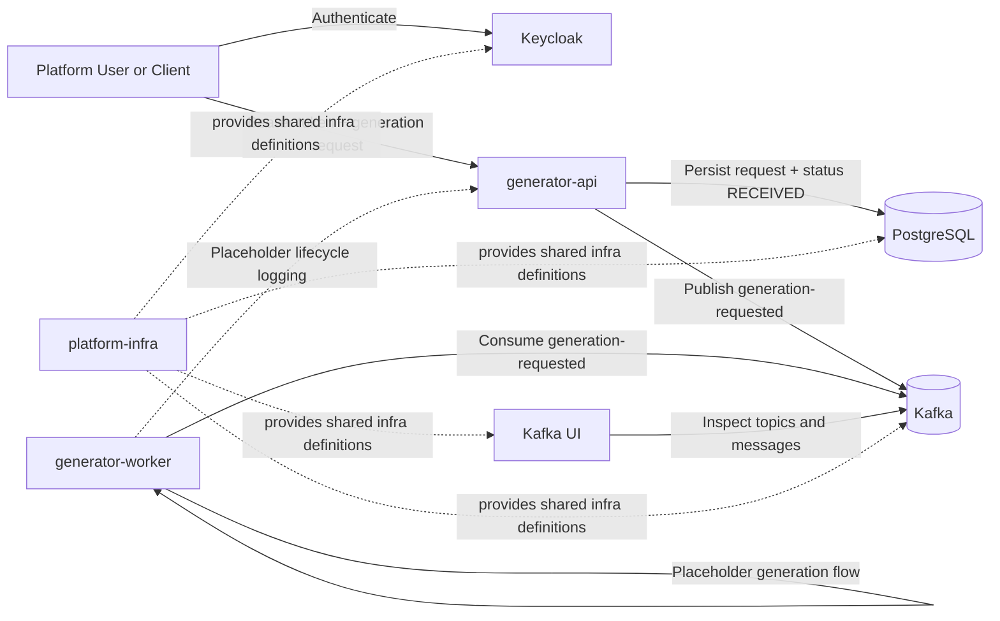
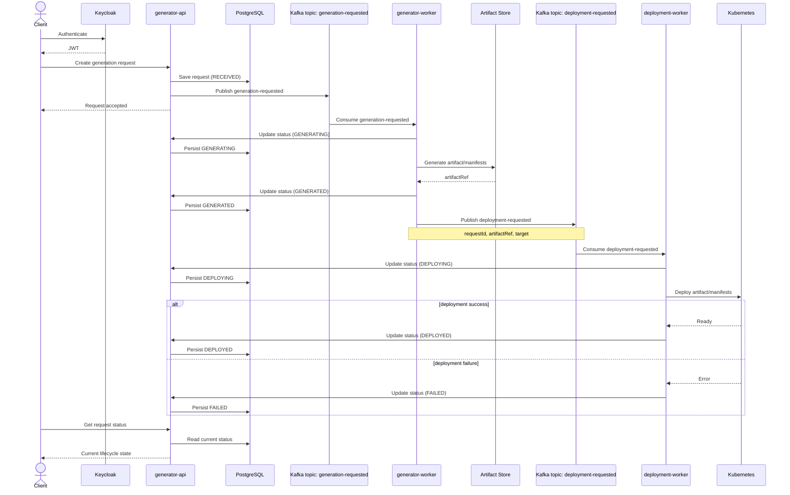
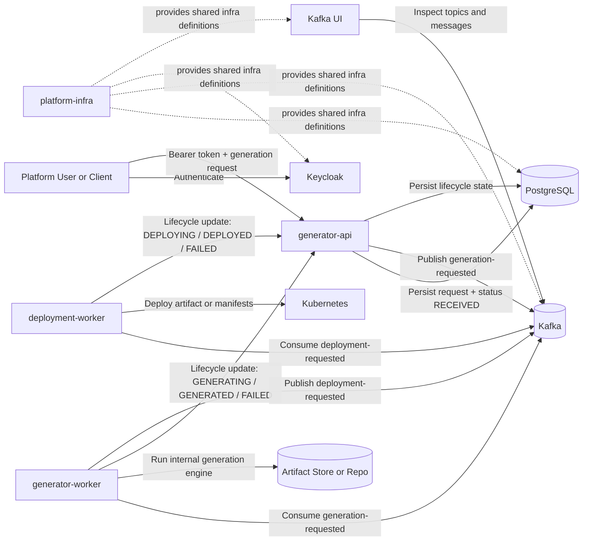

# ScaffoldOps High-Level Architecture

## Overview

ScaffoldOps currently has an implemented intake-and-generation shell, and a defined target state for generation-to-deployment orchestration.

- The current implemented platform includes `generator-api`, `generator-worker`, PostgreSQL, Kafka, Kafka UI, Keycloak, and shared Kubernetes manifests in `platform-infra`.
- The refined target state adds a future `deployment-worker`, a `deployment-requested` Kafka topic, and a durable artifact handoff between generation and deployment.
- `generator-api` remains the lifecycle system of record in both the current and target architecture.

## Current Implemented Architecture

The implemented system today is a hybrid REST + event-driven flow:

- `generator-api` accepts authenticated generation requests.
- `generator-api` persists requests in PostgreSQL with initial status `RECEIVED`.
- `generator-api` publishes `generation-requested` to Kafka.
- `generator-worker` consumes that event and runs a placeholder generation-stage flow.
- Worker lifecycle updates are currently logged, not persisted back through a real API contract.

### Current System Context

## Refined Target-State Architecture

The target state extends the current platform without changing core ownership:

- `generator-api` continues to own request persistence and lifecycle status.
- `generator-worker` keeps the generation engine internally and does not split it into a separate microservice.
- After successful generation, `generator-worker` publishes a `deployment-requested` event.
- `deployment-worker` consumes that event and deploys the generated artifact or manifest bundle to Kubernetes.
- Clients continue to read lifecycle state only from `generator-api`.

### Target-State Sequence Diagram

The diagram below is the target-state architecture flow. It describes the intended end-to-end generation-to-deployment lifecycle and is not a claim that the deployment stage is already implemented in the current platform.

`docs/uml/scaffoldops-flow.puml` remains the source of truth for this flow. This Mermaid rendering exists so the diagram is visible in markdown-based documentation where native PlantUML rendering is not configured.

[PlantUML source: `docs/uml/scaffoldops-flow.puml`](/home/victor/workspace/ScaffoldOps/scaffoldops-docs/docs/uml/scaffoldops-flow.puml)

### Target-State System Context

## Responsibility Boundaries

### `generator-api`

- Accepts generation requests through REST.
- Validates incoming payloads.
- Persists request records in PostgreSQL.
- Sets the initial lifecycle state to `RECEIVED`.
- Publishes `generation-requested`.
- Exposes request retrieval endpoints.
- Owns persisted lifecycle state for the full request lifecycle.

### `generator-worker`

- Consumes `generation-requested`.
- Orchestrates generation asynchronously.
- Updates lifecycle through `generator-api` for generation-stage progress.
- Runs the generation engine internally.
- Produces a durable artifact or manifest reference on success.
- Publishes `deployment-requested` after generation succeeds.

### `deployment-worker`

- Future-state component, not implemented yet.
- Consumes `deployment-requested`.
- Orchestrates deployment asynchronously.
- Deploys the generated output to Kubernetes.
- Updates lifecycle through `generator-api` for deployment-stage progress.

### PostgreSQL

- Stores request records and lifecycle status owned by `generator-api`.

### Kafka

- Carries asynchronous handoff events between lifecycle stages.
- Current topic: `generation-requested`.
- Target-state additional topic: `deployment-requested`.

### Artifact Store or Repo

- Holds the durable output from generation.
- Provides the reference passed from `generator-worker` to `deployment-worker`.
- Must be treated as a required architectural boundary in the target state rather than an implicit in-memory handoff.

## Target-State Flow

1. A client authenticates with Keycloak and submits a generation request to `generator-api`.
2. `generator-api` persists the request in PostgreSQL with status `RECEIVED`.
3. `generator-api` publishes `generation-requested`.
4. `generator-worker` consumes the event and updates `generator-api` to `GENERATING`.
5. `generator-worker` runs its internal generation engine and writes output to a durable artifact location.
6. On successful generation, `generator-worker` publishes `deployment-requested` with `requestId`, artifact reference, and deployment target.
7. `generator-worker` updates `generator-api` to `GENERATED`.
8. `deployment-worker` consumes `deployment-requested` and updates `generator-api` to `DEPLOYING`.
9. `deployment-worker` deploys the generated output to Kubernetes.
10. `deployment-worker` updates `generator-api` to `DEPLOYED` on success or `FAILED` on deployment-stage failure.
11. The client reads the latest lifecycle state from `generator-api`.

## Key Contracts To Preserve

- `generator-api` is the system of record for lifecycle status.
- `generator-worker` owns generation execution, not persistent lifecycle ownership.
- `deployment-worker` owns deployment execution, not persistent lifecycle ownership.
- `generation-requested` is the intake-to-generation handoff.
- `deployment-requested` is the generation-to-deployment handoff.
- The generation-to-deployment handoff must carry a durable artifact reference, not raw generated content.

## Practical Incremental Notes

- The current code already supports `RECEIVED`, `GENERATING`, `GENERATED`, `DEPLOYING`, `DEPLOYED`, and `FAILED` in the API contract.
- The current deployed workflow only implements the intake plus generation shell.
- The target state should add lifecycle update endpoints or an equivalent internal contract in `generator-api` before workers are expected to converge request state.
- The target state should also add idempotency handling, retry strategy, and durable event publication around the generation-to-deployment handoff.

For the target-state sequence source, see [PlantUML source: `docs/uml/scaffoldops-flow.puml`](/home/victor/workspace/ScaffoldOps/scaffoldops-docs/docs/uml/scaffoldops-flow.puml).
